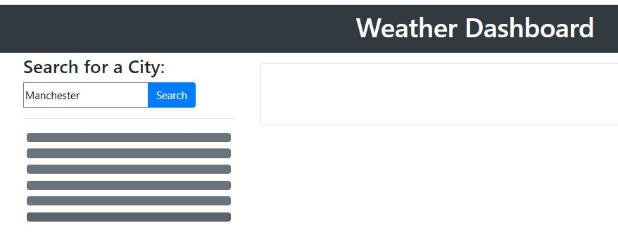
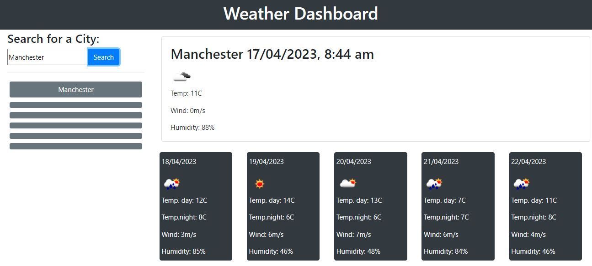
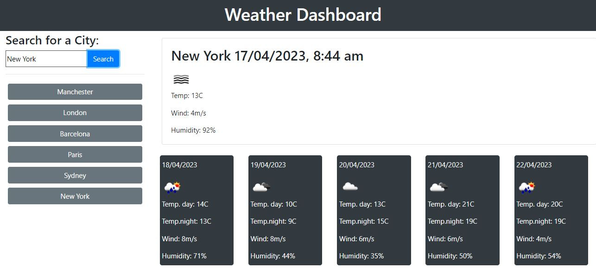
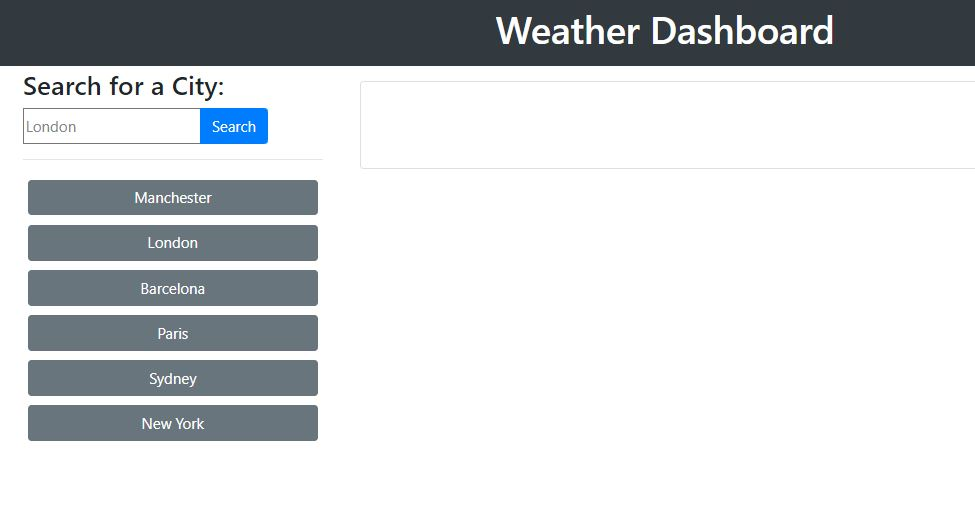
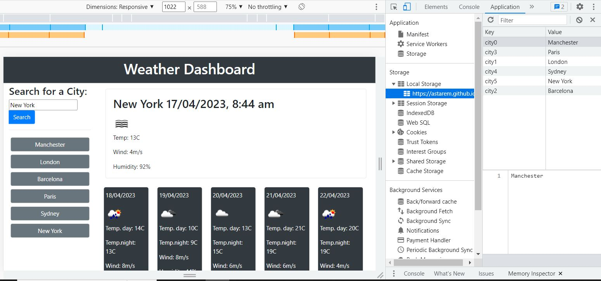

# Weather app

## Description

I made this weather app for a traveler, so they can see the weather outlook for multiple cities anywhere in the world and plan their trip accordingly.

## Languages/libraries/tools used

- Open Weather API
- JavaScript
- jQuery
- Bootstrap
- CSS
- HTML

## Installation

There is no installation needed, app works in the browser.

## Usage

Please [click here](https://astarem.github.io/weather-app/) to view deployed app.

Traveler need to enter the city name into search field and hit "Search" button:

After clicking the search button, the weather for this city for today and 5 days forecast is displayed: 

After user does few searches, six last searches(cities) are saved and displayed on the buttons: 

User can click a city button and retrieve today's weather and forecast for this city again.
Even when user refreshes the page or closes the window - when they come back, the city names are still displayed on the buttons:

That is possible because user search is saved in local storage:

